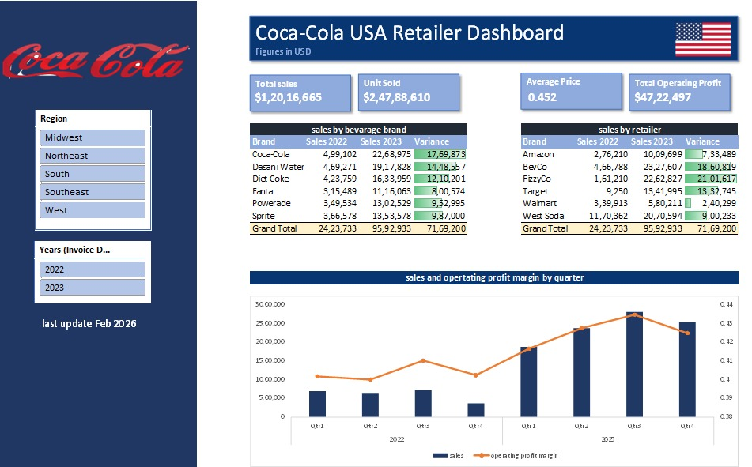

# Coca-Cola USA Sales Dashboard

Excel-based Coca-Cola Sales Dashboard project analyzing revenue, profit, regional performance, and product-wise sales trends. Demonstrates data cleaning, transformation, KPI tracking, and interactive visualization skills using Pivot Tables, charts, and slicers.

##  Project Overview

The Coca-Cola USA Sales Dashboard is a data analytics project designed to analyze and visualize sales performance across multiple Coca-Cola brands such as Coca-Cola, Sprite, Fanta, and Dasani across different regions and retailers in the United States.
The dashboard highlights key metrics including Total Sales, Units Sold, Average Price, Operating Profit, and Operating Margin, enabling year-over-year comparison (2022 vs 2023) and trend analysis to support data-driven decision-making.

## Business Problem

The objective of this project is to analyze sales performance across regions, brands, and retailers to identify growth trends, profitability patterns, and performance gaps. 
The dashboard helps stakeholders monitor KPIs and make data-driven business decisions.

## Dashboard Preview



##  Key Features
-KPI Cards (Total Sales, Units Sold, Average Price, Operating Profit)
- Sales by Beverage Brand (2022 vs 2023)
-  Sales by Retailer (2022 vs 2023)
-  Quarterly Sales Trend Analysis
-  Operating Profit Margin Analysis
-  Region Filter (Midwest, Northeast, South, Southeast, West)
-  Year Filter (2022, 2023)
  
## 🗂 Dataset Information

The dataset contains retail sales transaction data for Coca-Cola products across different regions in the United States. It includes information about retailers, product brands, pricing, sales performance, and profitability metrics.

###  Columns Description

| Column Name        | Description |
|--------------------|------------|
| Retailer           | Name of the retailer selling the product |
| Retailer ID        | Unique identifier assigned to each retailer |
| Invoice Date       | Date of the sales transaction |
| Region             | Sales region (Midwest, Northeast, South, Southeast, West) |
| State              | State where the sale occurred |
| City               | City where the sale occurred |
| Beverage Brand     | Brand name (Coca-Cola, Sprite, Fanta, Dasani, etc.) |
| Price per Unit     | Selling price of a single unit |
| Units Sold         | Number of units sold |
| Total Sales        | Total revenue generated (Price per Unit × Units Sold) |
| Operating Profit   | Profit earned after operating expenses |
| Operating Margin   | Profit percentage calculated from total sales |

The dataset is used to analyze sales trends, brand performance, regional distribution, and overall profitability.

## Key Calculations 

The following metrics were calculated using Excel formulas and Pivot Tables:

### Total Sales
Calculated using SUM function:
```excel
=SUM(range)
```

### Total Units Sold
```excel
=SUM(range)
```

### Average Price
```excel
=AVERAGE(range)
```

### Operating Margin
Calculated as:
```excel
=Operating Profit / Total Sales
```

Pivot Tables were used to aggregate sales by Year, Region, Brand, and Retailer.

## Key Insights

- 2023 sales outperformed 2022 across most regions, indicating strong year-over-year growth.
- The Coca-Cola brand generated the highest total revenue among all brands.
- Q3 recorded the highest sales performance, suggesting possible seasonal demand impact.
- Certain retailers consistently contributed higher revenue and operating profit compared to others.
- Operating profit margin showed improvement in 2023, reflecting better cost efficiency and pricing strategy.
- Regional analysis shows variation in performance, highlighting potential growth opportunities in underperforming regions.

## Tools & Technologies Used

- Microsoft Excel
- Pivot Tables
- Pivot Charts
- Slicers for interactive filtering
- Excel Formulas (SUM, AVERAGE, IF, etc.)
- Data Cleaning and Data Validation Techniques
- KPI Cards and Dashboard Design Principles
